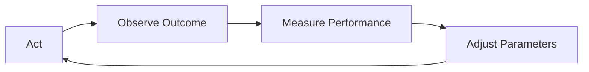

# Formatting Reference

## Session Log Filename Pattern

**Pattern:** `[[ProjectName — Topic Summary — YYYY-MM-DD]].md`

Rules:
- Em dash separator ` — ` (space + em dash + space), NEVER hyphen ` - `
- Topic Summary: 3-8 words, concise, specific, data-driven when possible
- Multiple sessions same day: append `Session 2`, `Session 3`
- Full path: `${NOTES_DIR}/[[ProjectName — Topic — YYYY-MM-DD]].md`

**Good filename examples:**
```
[[FORTRESS — Full V1 Build, Persona Consolidation, Standards Audit — 2026-04-08]].md
[[ExampleProjectB v0.4.0 Session 5 — 2026-03-23]].md
[[ExampleProjectA v36 Audit Round 2 — 2026-03-21]].md
[[ExampleProject — Auth Refactor and Rate Limiting — 2026-04-10]].md
[[ExampleProjectE Session 4+5 — 50-Item Mega Upgrade — 2026-03-23]].md
```

---

## Session Log Required Sections (In Order)

### 1. H1 + Metadata Block

```
# ProjectName — Topic Summary

**Date:** YYYY-MM-DD
**Project:** [[ProjectName]]
**Session:** N (if continuation is obvious, otherwise omit)
**Duration:** ~Xh (estimate from git timestamps or conversation depth)
**Model:** [[Claude Opus 4.6]] (1M context)
```

### 2. Summary

2-5 sentences. What was the mission? What was accomplished? What's the headline result? Be specific and quantitative. Separated from metadata by `---`.

### 3. What Was Done

The meat of the note. Use tables, `###` sub-sections, and concrete specifics. This should be the longest section. Every sub-section should contain either a table, a code block, or a mermaid diagram where appropriate.

### 4. Key Decisions & Reasoning

Every significant decision + the reasoning behind it. Use `###` sub-headers for each decision if there are multiple. Include alternatives considered and why they were rejected.

### 5. Architecture / Technical Details

Mermaid diagrams for architecture, data flow, state machines, phase sequences, or component relationships discussed. Code blocks for configs. Tables for comparisons. If no architecture was discussed, briefly note "No architecture changes this session."

### 6. Files Modified

Table format:

```
| File | Status | Purpose |
|------|--------|---------|
| `path/to/file.py` | NEW / MODIFIED / DELETED | What and why |
```

If no files were modified: "No files modified this session."

### 7. Next Steps

Prioritized bullet list of what should happen in the next session. Specific and actionable.

### 8. Git Log

Fenced code block with git log output (abbreviated hash + commit message). If no commits: "No commits this session."

### 9. Related

Wikilinked concepts, other session notes, project links with brief context:

```
- [[Concept Name]] — brief context for the link
- [[Other Session Note]] — if continuation
- [[Project Name]] — always link the project
```

### 10. Tags

Bottom of file. Always include `#claudecode #session-log`. Add project tag (`#fortress`, `#orrc`, `#exampleproject`). Add topic tags (`#security`, `#audit`, `#refactor`, `#bugfix`, `#architecture`, `#new-feature`). Lowercase kebab-case.

---

## Formatting Rules

1. **`[[Double brackets]]` on EVERYTHING** — technologies, frameworks, tools, standards, projects, people/companies, patterns, concepts, algorithms, named entities. Aim for 20+ unique wikilinks per session log.

2. **Tables for structured data** — never use bullet lists where a table would be cleaner.

3. **Mermaid diagrams** — use when architecture, flow, or state was discussed. Types: `graph LR`, `graph TD`, `sequenceDiagram`, `stateDiagram-v2`, `flowchart`.

4. **Fenced code blocks** with language identifiers: `python`, `typescript`, `json`, `yaml`, `bash`, `text`.

5. **`---` horizontal rules** between major sections.

6. **No filler** — every sentence carries information. "This was a productive session" = DELETE. "Built 4,982 lines across 15 commits" = KEEP.

7. **Factual precision** — exact numbers, exact names, actual error messages in code blocks.

---

## Concept Note Format

**Filename:** `[[Concept Name]].md` (title case, most recognizable name)

Structure:
- YAML frontmatter with tags
- H1 title
- Opening paragraph (2-4 sentences defining the concept)
- `## Core Idea / How It Works` — detailed explanation with mermaid/code/tables
- `## Implementations / Examples / In Practice` — with `### [[Project Name]]` sub-headers
- `## Why It Matters` — 1-3 sentences
- `## Related` — wikilinked concepts with brief context per link
- Bottom tags

**Rules:**
- Minimum 15-20 lines of real content (not stubs)
- Minimum 5-10 [[wikilinks]]
- Cross-project references where the concept spans multiple projects
- YAML frontmatter with tags at top AND tags repeated at bottom
- One concept per note — never combine two concepts into one file
- Factual accuracy — if uncertain, state the uncertainty

---

## Session Index MOC Template

File: `[[ClaudeCode Session Index]].md` in the ClaudeCode Notes folder.

```
# ClaudeCode Session Index

> Master index of all [[Claude Code]] session notes, organized chronologically and by project. Entry point to the session knowledge graph.

## By Date (Recent First)

| Date | Project | Session Note | Concepts Created |
|------|---------|-------------|------------------|
| YYYY-MM-DD | [[ProjectName]] | [[Session Note Title]] | [[Concept1]], [[Concept2]] |

## By Project

### [[ProjectName]]
- [[Session Note 1]]
- [[Session Note 2]]

## Stats
- **Total Sessions:** N
- **Total Concept Notes:** N
- **Projects Covered:** N

#claudecode #index #moc #session-log
```

---

## Gold Standard Example: Session Log

Below is an actual session log from the vault. It demonstrates the quality bar — section structure, wikilink density, tables, mermaid diagrams, factual precision, and zero filler. When writing session logs, match this level of detail and formatting.

BEGIN EXAMPLE SESSION LOG ---

# FORTRESS — Full V1 Build, Persona Consolidation, Standards Audit & Skill Ecosystem Research

**Date:** 2026-04-08 → 2026-04-09 (overnight session)
**Project:** [[FORTRESS Protocol]]
**Session:** 1 (continued from glitched session, ran into early morning hours)
**Duration:** ~8+ hours across reconnect + full build + research
**Model:** [[Claude Opus 4.6]] (1M context)

---

## Summary

Built the complete [[FORTRESS Protocol]] — an open-source adversarial security audit framework for [[Claude Code]] — from skeleton to **4,982 lines** across **17 git commits**. Implemented all 9 phases, 448 attack personas across 24 squads, defense-grade standards mapping across 10 frameworks, and a 10-artifact evidence suite. Recovered from a mid-build session disconnect with zero data loss. Executed major persona consolidation (-13 redundancies) and expansion (+16 net new personas including a full [[Squad 23]] for multi-agent/NHI security). Discovered and corrected critical stale data in standards reference tables (OWASP Web 2025 was actually the 2021 list, OWASP ASI 2026 was entirely fabricated by a previous agent). Added execution logging as 10th artifact, [[React2Shell]] CVE quick-check, and model-agnosticism note. Wrote portfolio-grade README, 1,044-line Session 2 context prompt, and conducted deep research on [[prompt engineering]] (58 techniques across 30+ sources) and the [[Claude Code]] skills ecosystem (100+ tools cataloged). Globally installed the skill. Prepared two skill design prompts for [[Obsidian]] session summaries and prompt enhancement.

---

## What Was Built

### The Skill File (`fortress.md`)

| Component | Details |
|-----------|---------|
| Total lines | 4,982 |
| Git commits | 17 on master |
| Phases | 9 (Phase 0 [[RECON]] → Phase 6 [[DEBRIEF]], including [[Phase 5b]]) |
| Personas | 448 across 24 squads (23 numbered + [[Wildcard]]) |
| Standards | [[CWE]] (62 entries), [[CVSS 4.0]], [[OWASP Web 2025]], [[OWASP LLM 2025]], [[OWASP ASI 2026]], [[NIST 800-53]] Rev 5.2.0, [[NIST SSDF]], [[DISA STIG]], [[MITRE ATT&CK]] v18.1, [[MITRE ATLAS]] v5.4 |
| Artifacts | 10 per audit (including new [[execution log]]) |
| Modes | 5 (full, quick, focused, verify, diff) |
| Installation | `~/.claude/skills/fortress/SKILL.md` (global) |

### Phase Architecture

```mermaid
graph LR
    P0[Phase 0: RECON] --> G1[Gate 1]
    G1 --> P1[Phase 1: SQUAD ASSEMBLY]
    P1 --> P2[Phase 2: ADVERSARIAL ASSAULT]
    P2 --> P3[Phase 3: VALIDATION]
    P3 --> P4[Phase 4: REPORT & PROPOSE]
    P4 --> G2[Gate 2]
    G2 --> P5[Phase 5: EXECUTE]
    P5 --> P5b[Phase 5b: INTEGRATION VERIFY]
    P5b --> G3[Gate 3]
    G3 --> P6[Phase 6: DEBRIEF]
```



### Squad Structure (24 Squads, 448 Personas)

| Category | Squads | Personas | Examples |
|----------|--------|----------|----------|
| Always Active | 5 (1-5) | 92 | [[Supply Chain]], [[Edge Cases]], [[Quantum Readiness]], [[Logging]], [[Code Quality]] |
| Conditionally Active | 15 (6-19, 23) | 290 | [[Web Security]], [[OAuth/JWT]], [[Payments]], [[AI/LLM]], [[Single-Agent MCP]], [[Multi-Agent NHI]], [[Blockchain]], [[Cloud]], [[Crypto]], [[Privacy]] |
| Language-Triggered | 2 (20-21) | 32 | [[Memory Safety]], [[Deserialization]] |
| Context-Triggered | 1 (22) | 16 | [[Vibecoder Detection]] |
| Wildcard | 1 | 18 | [[Red Team]], [[Purple Team]], [[Gold Team]], [[Orange Team]], [[Green Team]] |

---

## Session Timeline (Chronological)

### Phase A: Reconnect & Integrity Verification
- Previous session glitched mid-build with 3 research agents running
- Verified all 12 prior commits intact, 4,788 lines, zero corruption
- Dispatched integrity audit agent → confirmed all 54 steps across 8 phases complete

### Phase E: Standards Data Audit — Found Critical Errors
Dispatched **7 parallel research agents** to verify ALL embedded standards:

| Standard | Verdict | Issue |
|----------|---------|-------|
| [[OWASP Web 2025]] | **WRONG** | Had 2021 list mislabeled as 2025. Every position shuffled. |
| [[OWASP ASI 2026]] | **WRONG** | Entire table fabricated. 3 invented categories. |
| [[MITRE ATLAS]] T0048 | **WRONG** | Named "Abuse of Agent Tools" — actual is "External Harms" |
| [[CWE Top 25 2025]] | GOOD | 25/25 coverage (100%) |
| [[CVSS 4.0]] | CORRECT | All metrics verified |
| [[DISA STIG]] | CORRECT | CAT I/II/III definitions accurate |
| [[NIST 800-53]] | CURRENT | Release 5.2.0 (Aug 2025), 3 new controls |
| [[MITRE ATT&CK]] | CURRENT | v18.1; **v19 drops April 28** |

**Lesson learned:** Never trust agent-gathered standards data without verification against authoritative sources.

---

## Files Created/Modified

| File | Lines | Purpose |
|------|-------|---------|
| `fortress.md` | 4,982 | The actual skill file (deliverable) |
| `README.md` | NEW | Portfolio-grade documentation |
| `SESSION2-PROMPT.md` | 1,047 | Context doc for next session |
| `~/.claude/skills/fortress/SKILL.md` | INSTALLED | Global skill copy |

---

## Next Session (Session 2)

1. **End-to-end test** of `/fortress quick` on [[ExampleProject]]
2. **Deep self-audit** of fortress.md (10 categories, 50+ specific checks)

---

## Git Log (17 commits)

```
ae91ea5 docs: add claude-spice to Session 2 prompt
be66fac docs: massively enhance Session 2 context prompt
8119e08 docs: add README for GitHub release and Session 2 context prompt
9fb37b6 feat: add execution logging as 10th artifact
c29fe74 feat: persona consolidation + expansion + standards correction
b91835b feat: add standards reference tables and detection heuristics
b8abccd feat: add complete persona taxonomy across 22 squads plus wildcard
3f546fa feat: implement Phases 5, 5b, 6 (execute, integration verification, debrief)
2b294b3 feat: implement Phase 4 artifact generation
42827c7 feat: implement Phase 4 standards enrichment
b080b65 feat: implement Phase 3 validation with grounding checks
330f677 feat: implement Phase 2 adversarial assault
ceab965 feat: implement Phase 1 squad assembly
188741b feat: implement Phase 0 recon with tiered analysis
a549eac feat: add master orchestration with phase sequencing
8b6563e feat: create fortress.md skill file skeleton
dc82145 initial: FORTRESS v2 design spec and implementation plan
```

---

## Related

- [[FORTRESS Protocol]]
- [[Agentic Security]]
- [[Claude Code Skills Ecosystem — Research Map — 2026-04-09]]
- [[Project Glasswing]]
- [[Claude Managed Agents]]
- [[OWASP ASI 2026]]
- [[MITRE ATLAS]]
- [[Prompt Engineering]]
- [[ExampleProject]]
- [[ExampleOrg Group LLC]]

---

#fortress #security #claude-code #adversarial-audit #owasp #nist #mitre #personas #antifragile #defense-grade #open-source #mavpro #prompt-engineering #skills-ecosystem #obsidian #session-1

END EXAMPLE SESSION LOG ---

---

## Gold Standard Example: Concept Note (Self-Learning Loop)

BEGIN EXAMPLE CONCEPT NOTE ---

---
tags: #pattern #architecture #ai #self-learning
---

# Self-Learning Loop

The most important recurring pattern in [[Dad]]'s work. Every major system is designed to **get smarter over time** without manual intervention.

## The Core Cycle



## Implementations Across Projects

### [[ExampleProjectA]]
- **[[Brier Score]]** calibration — measures how well predictions match reality
- **[[Strategy Evolution Log]]** — records what worked, what didn't, and why
- **[[Performance Drift Tracker]]** — detects when a strategy stops working
- **[[Category Performance Gate]]** — auto-blocks underperforming categories for 6 hours
- **`auto_tune_from_calibration()`** — automatically adjusts thresholds based on [[Brier Score]] history
- **[[Dynamic Keyword Intelligence]]** — keywords that performed well get boosted, losers get demoted

### [[ExampleProjectB]]
- **[[learner.py]]** — tracks which designs sell, which niches engage, learns from revenue data
- **[[trend_monitor.py]]** — detects emerging crypto trends before they peak
- **[[SOUL.md]]** v3.0 — the agent's personality evolves based on what resonates

### [[ExampleProjectE]]
- **[[Knowledge Confidence Decay]]** — stored knowledge loses confidence over 90 days, forcing re-verification
- **[[Duplicate Knowledge Detection]]** — semantic similarity > 0.9 prevents knowledge bloat
- **[[Sentiment Radar]]** — tracks interaction quality to improve response calibration
- **[[Interaction Category Tagging]]** — categorizes every conversation for pattern analysis

### [[Grok Multi-Agent System]]
- **[[Forecast]]** agent tracks [[Revision Triggers]] — conditions that should update a prediction
- **[[Bloodhound]]** maintains [[Source Hierarchy]] that evolves based on reliability

## Why It Matters

Systems that don't learn are static. Static systems get outcompeted. The [[Self-Learning Loop]] is what separates a script from an [[Autonomous AI Systems|autonomous AI system]].

> "The goal isn't to build something that works today. It's to build something that works **better tomorrow** than it did today." — [[User's Working Philosophy]]

## Related Concepts
- [[Brier Score]] — the measurement backbone
- [[Reinforcement Learning]] — the theoretical framework
- [[Paper-to-Live Progression]] — learn in simulation before risking real capital
- [[Budget Awareness]] — learning has a cost, optimize it

#pattern #self-learning #core-philosophy

END EXAMPLE CONCEPT NOTE ---

---

## Gold Standard Example: Concept Note (Circuit Breakers)

BEGIN EXAMPLE CONCEPT NOTE ---

---
tags: #pattern #risk #safety #architecture
---

# Circuit Breakers

A [[Risk Management]] pattern borrowed from electrical engineering and financial markets — **automatic shutdown when conditions become dangerous**.

## The Concept

In electrical systems, a circuit breaker trips when current exceeds safe levels, preventing fire. In trading and AI systems, circuit breakers trip when losses or errors exceed safe levels, preventing catastrophe.

## Implementations in the Vault

### [[Crypto Scalper]]

| Trigger | Action | Rationale |
|---------|--------|-----------|
| 3 consecutive losses | Half position size | Something's off — reduce exposure |
| 5 consecutive losses | Pause trading entirely | System is broken — stop bleeding |
| 75% daily budget consumed | **Hard pause** | Preserve capital for tomorrow |

### [[SelfHealer Engine]]
- Max **5 auto-repairs per hour**
- Prevents repair loops: fix A breaks B, fix B breaks C, fix C breaks A...
- Dedup guard prevents repairing the same issue twice per cycle

### [[ExampleProjectE]]
- **30 msg/min [[Rate Limiting]]** — prevents abuse or runaway loops
- **10K char [[Input Cap]]** — prevents prompt injection via massive payloads
- **[[SSRF IPv6 Protection]]** — blocks internal network access

### [[ExampleProjectA]] Main Bot
- [[Category Performance Gate]] — auto-blocks underperforming categories for 6 hours
- [[Drawdown Containment]] — portfolio-level exposure limits
- [[Expensive NO Guard]] — blocks NO contracts above 65c (low reward, high risk)

## Design Principles

1. **Trip fast** — better to miss a trade than to lose money on a broken system
2. **Auto-reset with caution** — scalper has `auto_resume_after_pause_minutes`, not permanent lockout
3. **Escalating severity** — 3 losses = reduce, 5 losses = stop (not 1 loss = panic)
4. **Log everything** — every circuit breaker trip feeds the [[Self-Learning Loop]]

## The NYSE Analogy

The New York Stock Exchange has market-wide circuit breakers:
- Level 1 (7% drop): 15-minute trading halt
- Level 2 (13% drop): 15-minute halt
- Level 3 (20% drop): Trading halted for the day

ExampleProjectA's circuit breakers follow the same graduated philosophy.

## Related
- [[Risk Management]] — parent concept
- [[Crypto Scalper]] — most sophisticated implementation
- [[SelfHealer Engine]] — repair-side circuit breaker
- [[Drawdown Containment]] — portfolio-level protection

#pattern #risk #safety

END EXAMPLE CONCEPT NOTE ---
